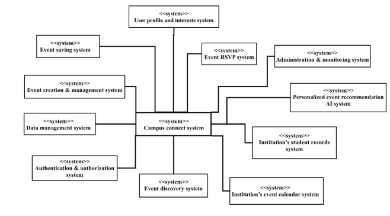

# LogicLab

The Campus Event Recommendation System is an AI-powered web application designed to help college and university students discover campus events that match their interests. Campus event information is often scattered across university websites, emails, student organizations, and social media, making relevant opportunities difficult to find.

The system centralizes campus events in one platform and provides personalized recommendations based on student interests and event information such as categories, tags, and descriptions. Students can also browse and search events, save events, and RSVP.

The primary users are students, while authorized student organizations, university departments, and event organizers can create and manage event listings. Colleges and universities are the primary target customers.

###### Core Features

- Student accounts and interest profiles
- Centralized campus event listings
- AI/ML-based personalized event recommendations
- Event search and filtering
- Saved events and RSVP functionality
- Event creation and management for authorized organizers

The initial version will be developed as a web application using a database for user and event information and an AI/ML recommendation component. Features such as ticket purchasing, financial transactions, room reservations, native mobile applications, and full integration with university systems are outside the initial project scope.

## System Context Daigram
 

## Team Member
- Brandon Jablasone (https://github.com/Bjablaso)
- Ankith Rajashekar (https://github.com/ankith860)
- Natalie Piltoyan (https://github.com/natpil)
- Nyeswaty Socree (https://github.com/nsocree)
